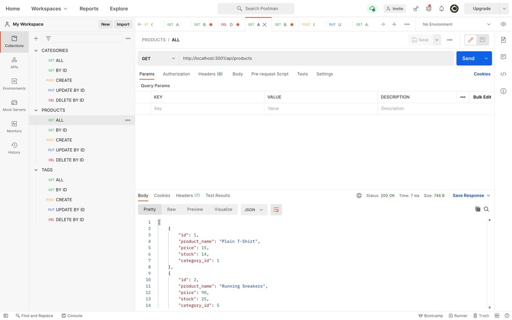

  <header align="center"> 
  <h1> 👓 E-Commerce_Back-end 👓 </h1> 
  </header>

# User-Story

    AS A manager at an internet retail company,
    I WANT a back end for my e-commerce website that uses the latest technologies
    SO THAT my company can compete with other e-commerce companies.

# Table of contents

- [User-Story](#user-Story)
- [Description](#Description)
- [Screenshots](#Screenshots)
- [Installations](#installations)
- [Usage](#usage)
- [License](#license)
- [Contributing](#Contributing)
- [Testing-Procedure](#Testing-Procedure)
- [Contact](#contact)

# Description

    Modifying starter code to create an app that will use Express, Sequalize and MySQL to interact with a working database.

# Screenshots

_ENTER SCREENSHOTS HERE_

# Installations

Open integrated terminal and type "npm install" to install all dependencies. NPM packages include: Sequalize, mysql, dotenv and express.
You are also required to have Node, MySQL and Postman installed on your device.

# Usage

Once all installations have been completed, follow the [walkthrough video](https://drive.google.com/file/d/1iejeRPc1e8wEi-8NVJW74Oz281wIL3uH/view?usp=sharing) for how to setup the program, in the terminal. Afterwards, watch the [demo video](https://drive.google.com/file/d/1EPh-gpZwjbfFxEDGqhi-CpzB3YOQmNpS/view?usp=sharing) to see how the app works using postman!

# Contributing

Pull request, contact me for inquiries.

# Testing-Procedure

Make sure the code works before creating a pull request.

# Contact

If you would like to reach me in regards to either questions or comments, I am more than
happy to respond via github [Hayden-code](https://github.com/Hayden-code) or email [haychjones@gmail.com](haychjones@gmail.com).
